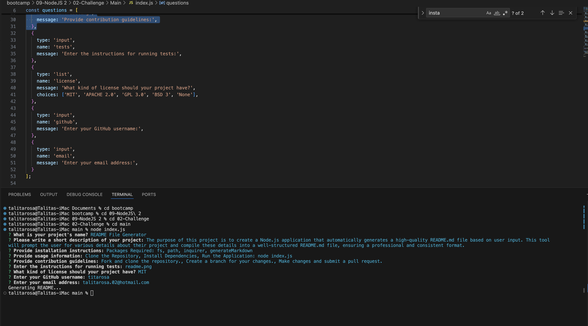

# README File Generator

## Description
The purpose of this project is to create a Node.js application that automatically generates a high-quality README.md file based on user input. This tool will prompt the user for various details about their project and compile these details into a well-structured README.md file, ensuring a professional and consistent format.

## Motivation
This application will save time by eliminating the need to manually set up the README file and will enhance the quality of the documentation.

## Table of Contents
- [Installation](#installation)
- [License](#license)
- [Image](#image)

## License
This project is licensed under the MIT license.

## Image

## Questions
If you have any questions about the repo, open an issue or contact me directly at talitarosa.02@hotmail.com. You can find more of my work at [titarosa](https://github.com/titarosa).
  